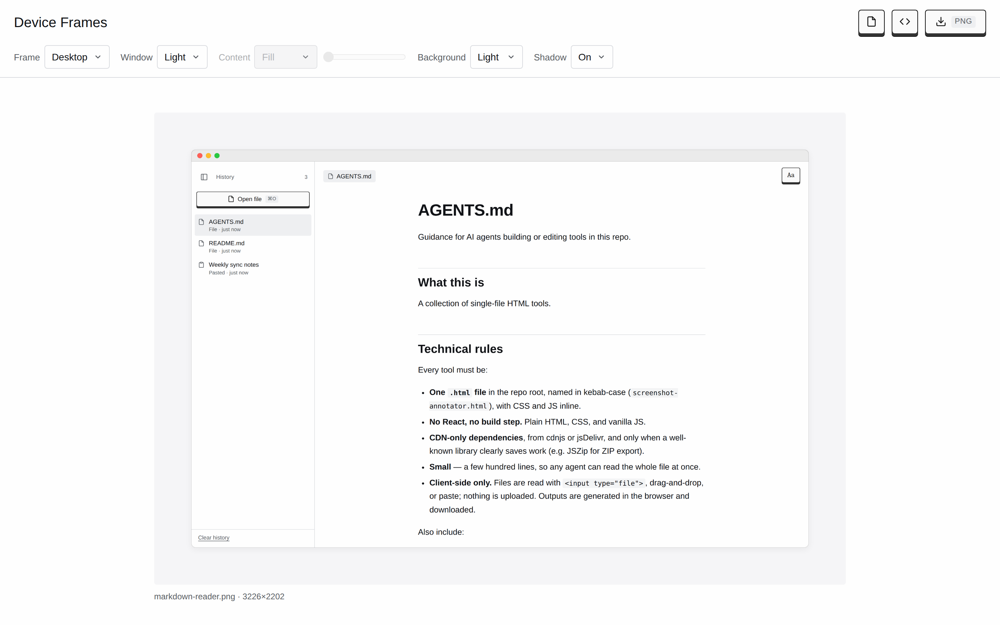

# HTML Utilities

A small collection of single-file HTML tools. Each tool is one `.html` file with everything inline. Open it in a browser and it works.

## Tools

| Tool | What it does |
| --- | --- |
| [Device Frames](https://kuynkank.github.io/html-utilities/device-frames.html) | Drop in a screenshot or screen recording and export it in a desktop window or mobile phone frame, as PNG or MP4. |
| [Markdown Reader](https://kuynkank.github.io/html-utilities/markdown-reader.html) | Paste or drop a Markdown file to read it rendered and wrapped, with adjustable font, size, and line width. |
| [Screenshot Notes](https://kuynkank.github.io/html-utilities/screenshot-annotator.html) | Pin color-coded sticky notes on a screenshot and export the feedback as a ZIP, annotated PNG, or JSON. |

Everything runs in your browser — files are never uploaded.

### Device Frames

Frames are drawn in code on a canvas, so they stay sharp at any size. Images export as PNG. Videos are re-encoded frame by frame with the browser's WebCodecs API (via [mediabunny](https://github.com/Vanilagy/mediabunny)) into an H.264 MP4 at the original frame rate. **Copy HTML** gives a CSS-only frame around your original file, for sites where you control the code.

### Markdown Reader

Markdown is rendered with [marked](https://github.com/markedjs/marked) and sanitized with [DOMPurify](https://github.com/cure53/DOMPurify). Settings and recent history are kept in `localStorage`, so they stay in your browser.

### Screenshot Notes

Pins are saved as percentages of the image, so they stay in place at any size. The annotated PNG is drawn on a canvas, and the ZIP is built with [JSZip](https://stuk.github.io/jszip/). The current session is kept in `localStorage`.

## Credits

[Simon Willison](https://simonwillison.net/) and [Philip Levy](https://github.com/pglevy) inspired the single-file approach here.

See article [Useful patterns for building HTML tools](https://simonwillison.net/2025/Dec/10/html-tools/).
