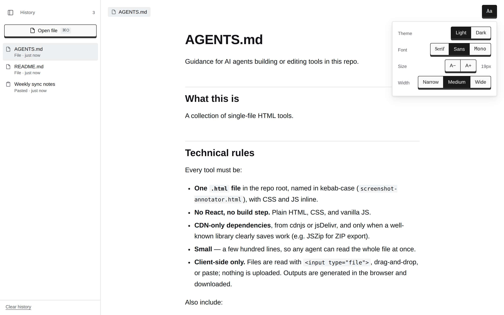
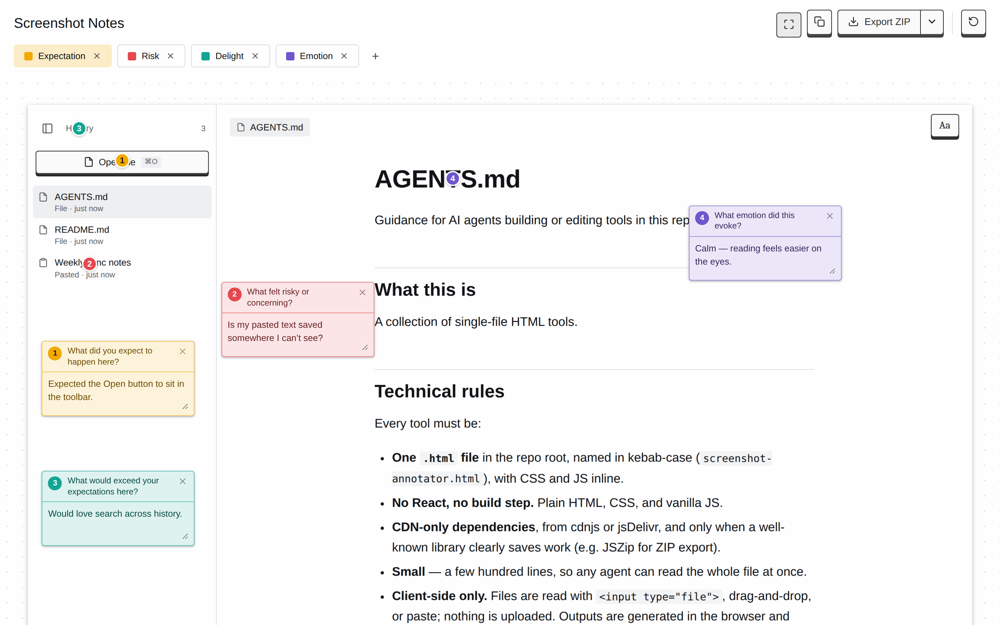

# HTML Utilities

A small collection of single-file HTML tools. Each tool is one `.html` file with everything inline. Open it in a browser and it works.

## Tools

| Tool | What it does |
| --- | --- |
| [Device Frames](https://kuynkank.github.io/html-utilities/device-frames.html) | Drop in a screenshot or screen recording and export it in a desktop window or mobile phone frame, as PNG or MP4. |
| [Markdown Reader](https://kuynkank.github.io/html-utilities/markdown-reader.html) | Paste or drop a Markdown file to read it rendered and wrapped, with adjustable font, size, and line width. |
| [Screenshot Notes](https://kuynkank.github.io/html-utilities/screenshot-annotator.html) | Pin color-coded sticky notes on a screenshot and export the feedback as a ZIP, annotated PNG, or JSON. |

### Markdown Reader

### Screenshot Notes

## Credits

[Simon Willison](https://simonwillison.net/) and [Philip Levy](https://github.com/pglevy) inspired the single-file approach here.

See article [Useful patterns for building HTML tools](https://simonwillison.net/2025/Dec/10/html-tools/).
